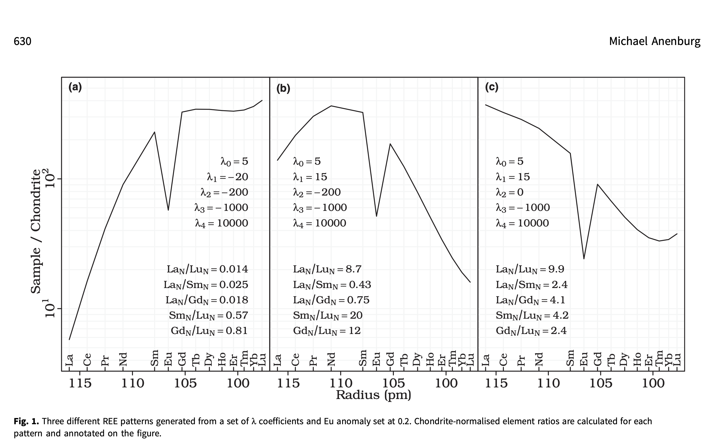

<font size="5">**Week 1 Reading Notes:**</font>   
<font size="3">***Book: Using Geochemical Data (Rollinson and Pease)***</font>

1. Normalising values can be chosen from 2 sets:      
i)CI chondrites   
ii)Ordinary chrondrites (volatile free, tend to have higher values).  
Therefore, it is important to cite the right data set. See pg.130 for dataset.   
Shale normalisation is used for upper crust sediments while Chondrite normalisation will be used in our project since we want to compare igneous rocks to primitive solar system. 

2. REE in minerals in Igneous Rocks:  
i)**Feldspars**: low concentration, but when in felsic rocks, Eu anomaly is positive   
ii)**Olivine**: very low concentration, unlikely to fractionate REE while fractionation/partial melting.   
iii)**Pyroxenes**: orthopyroxenes have lower REE than clinopyroxenes. In mafic rocks, REE are mostly present in clinopyroxene. Pyroxenes have small negative anomalies but maybe be higher in clinopyroxenes.  
iv)**Hornblende**: enriched in middle REE, have higher concentration of HREE that forms a U-shaped REE pattern in melt.   
v)**Garnet**: high abundance of HREE to the extent that they are compatible whilst LREE aren't.    
vi)**Muscovite**: enriched in REE, especially in felsic rocks. negative Eu anomaly.    
vii)**Biotite**: less enriched in REE, negative Eu anomaly.   
viii)**Zircon**: deplete a melt in HREE.     
ix)**Other accessory phases**: strong influence on REE pattern even if they have low abundance. They have high partition coefficients which result in disproportionate influence and depletion in REE.      

3. Multi-element Diagrams (MeD):  
i)**Chondrite-Normalised MeD**: advantageous since it uses directly measured values instead of calculated ones. It might not be very suitable for sediment and evolved igneous rocks ( do they mean metamorphic?). They have plotted REE and and some other trace elements in order of increasing mantle compatibility on log scale using normalised values with McDonough and and Sun(1995) and Palme and ONeil(2014) as reference values.  
ii)In evolved igenous rocks, anomalies may be controlled by specific mineral as mentioned in point 2 above where LREE are controlled by allanite and HREE by garnet. 

<font size="5">***Code for Week 1: Spider Plot Function***</font>

In a Spider Diagram, we will be representing the log normalised concentrations of Rare Earth Elements. The following Elements will be plotted: 
La-Lanthanum, Ce- Cerium, Pr- Praseodymium, Nd- Neodymium, Pm- Promethium, Sm- Samarium, Eu- Europium, Gd- Gadolinium,, Tb- Terbium, Dy- Dysprosium, Ho- Holmium, Er- Erbium, Tm- Thulium, Yb- Ytterbium, Lu- Lutetium 

Data 
```{r,echo=TRUE,eval=FALSE}
#downloading dataset
adakite <- read.csv(file = 'Data/ADAKITE.csv')
alkali_basalt <- read.csv(file = 'Data/ALKALI_BASALT.csv')
andesite <- read.csv(file='Data/ANDESITE.csv')
ankaramite <- read.csv(file='Data/ANKARAMITE.csv')
basalt <- read.csv(file = 'Data/BASALT.csv')
dolerite <- read.csv(file='Data/DOLERITE.csv')
gabbro <- read.csv(file='Data/GABBRO.csv')
granite <- read.csv(file='Data/GRANITE.csv')
hawaiite <- read.csv(file='Data/HAWAIITE.csv')
kimberlite <- read.csv(file='Data/KIMBERLITE.csv')
peridotite <-read.csv(file='Data/PERIDOTITE.csv')
pyroxenite <-read.csv(file='Data/PYROXENITE.csv')
rhyolite <-read.csv(file='Data/RHYOLITE.csv')
ref <- read.csv(file='Data/Normalised Values.csv')
```

Samples
```{r,echo=TRUE,eval=FALSE}
# gathering REE data from sample
ree_sample1 <- as.numeric(adakite[19, 119:132]) 
ree_sample2 <- as.numeric(alkali_basalt[20, 119:132]) 
ree_sample3 <- as.numeric(andesite[7, 119:132]) 
ree_sample4 <- as.numeric(ankaramite[80, 119:132]) 
ree_sample5 <- as.numeric(basalt[20, 119:132])
ree_sample6 <- as.numeric(dolerite[20, 119:132])
ree_sample7 <- as.numeric(gabbro[20, 119:132])
ree_sample8 <- as.numeric(granite[20, 119:132])
ree_sample9 <- as.numeric(hawaiite[19, 119:132])
ree_sample10 <- as.numeric(kimberlite[20, 119:132])
ree_sample11 <- as.numeric(peridotite[10, 119:132])
ree_sample12 <- as.numeric(pyroxenite[20, 119:132])
ree_sample13 <- as.numeric(rhyolite[20, 119:132])
# taking reference values 
ree_ref <- as.numeric(ref[3:16, 14]) #column 4,5 dont work
colors <- c("black","red","yellow","lightblue","green","orange","pink","cyan","purple","brown","gold","violet","navy")
rock_names_graph <- c("adakite","alkali_basalt","andesite","anakaramite","basalt","dolerite","gabbro","granite","hawaiite","kimberlite","peridotite","pyroxenite","rhyolite")
```

Spider Plot Function
```{r,echo=TRUE,eval=TRUE}
#this is a function for plotting spider plots for REE data
plot_spider <- function(samples,reference_values,logscale=TRUE,colors=NULL,main= "Spider Plot for Normalised REE Values",xlab="Rare Earth Elements",ylab ="Normalised values")
{
  # these are the REE we will be covering generally
  REE_symbols <-  c("La","Ce","Pr","Nd","Sm","Eu","Gd","Tb","Dy","Ho","Er","Tm","Yb","Lu")
  if (is.null(colors)) 
  {
  colors <- c("black","red","yellow","lightblue","green","orange","pink","cyan","purple","brown","gold","violet","navy")
  }
  # normalising values of samples with the reference set
  normalised_values <- lapply(samples,function(s1) as.numeric(s1)/as.numeric(reference_values))
  #axis range
  ymin <- if (logscale) min(unlist(normalised_values), na.rm = TRUE) else 0
  ymax <- max(unlist(normalised_values), na.rm = TRUE)
  # generate plot 
  plot(1:length(reference_values),normalised_values[[1]],type="b",xaxt="n",,xlab="Rare Earth Elements",ylab ="Concentration",log = 'y',ylim = c(ymin, ymax),col=colors[1])
  axis(1,at=1:length(reference_values),labels = REE_symbols)
  grid(nx=NULL, ny=NULL,col="gray",lwd=1)
  
  abline(h=1,col="black",lwd=3)
  
  # generate other plots 
   if(length(normalised_values)>1)
   { 
       for(i in 2:length(normalised_values))
       {
         lines(1:length(reference_values),normalised_values[[i]],type="b",col=colors[i])
       }
   }
   legend("right", legend = rock_names_graph, col = colors[1:length(samples)], lty = 1, lwd = 2, bty = "n")
}
```

```{r,echo=TRUE,eval=FALSE}
samples <- list(ree_sample1,ree_sample2,ree_sample3,ree_sample4,ree_sample5,ree_sample6,ree_sample7,ree_sample8,ree_sample9,ree_sample10,ree_sample11,ree_sample12,ree_sample13)

plot_spider(samples, ree_ref,main = "REE Spider Diagram (Sample 19, Reference: m&s )")
```

<font size="5">**Week 2 Reading Notes:**</font>  

<font size="3">***Research Paper- O'Neill(2016) :"The Smoothness and Shapes of Chondrite-normalized Rare Earth Element Patterns in Basalts"***</font>

1. Normalised REE patterns are important to study since they provide information about behaviour of incompatible trace elements. 
2. Spider Plots are problematic since they 'destroy' the shape of the REE pattern.
3. Aim of this paper is to quantify REE shapes precisely with a large number of datasets.
4. **Lanthanide Contraction**: 5s and 5p shells contract towards the nucleus due increased nuclear charge as a result of the 4f electrons present in the shell before them. 
5. The 3+ ionic state governs chemical properties of REE. 
6. Z and ionic radius can both be used as independent variables to plot normalised REE data to produce smooth graphs. 
7. Y/Ho values are almost constant due similar ionic radii. 
8. Anomaly in smoothness is due to Eu2+ state which has a half filled subshell providing stability. 
9. If Eu2+ /Eu3+ is measurably greater than zero in a petrogenetic process, the Eu partition coefficient for that process will deviate(due to Eu anomaly) from the smooth pattern estalished by the other REE 

<font size="3">***Research Paper- Coryell,Chase & Winchester(1963) :"A Procedure for Geochemical Interpretation of Terrestrial Rare-Earth Abundance Patterns"***</font>

1. The zig--zag pattern in REE concentration plots emerges from relative enrichment or depletion of REE during natural processes. This zig zag pattern can be removed by normalising the REE abundance with bronzite chondrite REE concentrations. 
2. Eu abundance is considerably low for most minerals(by factor of 14 for samarskite, 3.7 for euxenite, 2.6 for monazite, 5.5 for xenotime)  due to it being divalent at some stage. 
3. The technique of extrapolation of the best fit line in a normalised graph is of great value as it helps deteremine values of other REE that might have not been measured in the sample. It also makes it possible to determine REE abundance in whole new rock.  
4. **Kirovograd Granite**:( How do you interpret these graphs? )  
i)HREE very high in garnet and apatite.    
ii)Biotite, Monazite, Feldspar+Quartz decrease with increase in Z. 
5. LREE are more enriched than HREE in basalt. 


<font size="3">***Research Paper- Anenburg(2020) :"Rare earth mineral diversity controlled by REE pattern shapes"***</font>

1. **Aim**: use lambda combinations to construct CI normalised REE plots in such a way that REE patterns for natural materials become predictable.  
2. La3+: large ionic radii, Lu3+: quite small due to lanthanide contraction.   
3. **LREE**: La to Sm.    
4. **MREE**: Sm to Dy.    
5. **HREE**: Eu to Lu.    
6. **Oddo–Harkins Rule**: elements with even atomic numbers are more abundant than their neighbouring odd-numbered elements. 7.**λ0** is the overall abundance of the REE.  
8. **λ1** is the linear slope (most instructive).        
9. **λ2** is the quadratic curvature (most instructive).    
10. **λ3** represents the inflections at the ends of patterns (sinusoidality).    
11. **λ4** term is required if any ‘W’ pattern is present.     
12. LaN/LuN is a measure of the overall slope of the pattern.LaN/ SmN is a measure of the LREE enrichment of a pattern. These are not always useful to represent sinusoidality or curves which makes authors use differnet ratios leading to too much confusion and biases.  

13. **They have generated REE patterns for λ values.**.  
14. Ce and Y dominate the REE pattern, just like the real world where they make up nearly 75.7% of REE minerals.Without Ce and Y other REE like La,Dy,Yb,Nd dominate. Yb is most dominant in these Ce and Y absent graphs.    
15. Eu is present in high concentrations in Ca-rich minerals like plagioclase and epidote. Eu anomaly needs to be at a certain level to be dominant for different λ values. Eu rich mineral could be found in anorthosites or epidosites. 
16. If Y is removed from the Levison suffixes, more REE minerals can be discovered. 

<font size="5">**Week 3 Notes**</font>  

<font size="3">***Using AlambdaR website to understand effects to change in λ values on the shape of the Normalised Values vs REE radii***</font>

*We have taken a negative Eu anomaly and positive Ce anomaly for all cases*

1. **Changing λ0:** When other coefficients are kept constant, changing λ0 changes the CI-normalised concentration by a factor and no change in the shape of the curve is observed. The entire curve goes up if λ0 is increased and goes down if  λ0 is decreased.       
2. **Changing λ1:** When other coefficients are kept constant, changing λ1 to a positive number or increasing it causes the concentration of HREEs to decrease while the LREEs are more abundant. When λ1 is decreased or changed to a negative number, the trend flips and HREEs become more abundant while LREEs have a lower concentration.      
3. **Changing λ2:** When other coefficients are kept constant, increasing λ2 makes the Eu anomaly (at the vertex) is more prevelant as the curve becomes U-shaped withe the MREEs having low concentration while the LREEs and HREEs are more abundant. When λ2 is 0 or a small number (between -200 & +200) the curve is relatively straight and not parabolic. When λ2 is a large negative number, the MREEs have a higher abundance than LREEs and HREEs but negative Eu anomaly persists.    
4. **Changing λ3:** adds to the cruvature, concentration doesn't change much even if it. is changed from +1000 to -1000. However, the sinusodiality becomes prevelant if λ3 is a very big or small number. It is hard to predict as clearly as prevoius cases how λ3 affects concentration.    
5. **Changing λ4:** when other λ are kept in a reasonable value range, λ4 produces a W-shape only when it is the order of 10^4 which seems like a very unreasonable value. 

<font size="5">***Code for Week 3: Data Simplifying Function***</font>
```{r,echo=TRUE,eval=TRUE}
data_simplifying <- function(input_data)
{
  REE_list <- c("LATITUDE.MIN","LONGITUDE.MIN","ROCK.NAME","LA.PPM.","CE.PPM.","PR.PPM.","ND.PPM.","SM.PPM.","EU.PPM.","GD.PPM.","TB.PPM.","DY.PPM.","HO.PPM.","ER.PPM.","TM.PPM.","YB.PPM.","LU.PPM.")
  complete_row <- complete.cases(input_data[, REE_list])
  refined_REE_data <- input_data[complete_row,REE_list]
  
} 

```

```{r,echo=TRUE,eval=FALSE}
simplified_adakite <- data_simplifying(adakite)
simplified_alkali_basalt <- data_simplifying(alkali_basalt)
simplified_andesite <- data_simplifying(andesite)
simplified_anakaramite <- data_simplifying(ankaramite)
simplified_basalt <- data_simplifying(basalt)
simplified_dolerite <- data_simplifying(dolerite)
simplified_gabbro <- data_simplifying(gabbro)
simplified_granite <- data_simplifying(granite)
simplified_hawaiite <- data_simplifying(hawaiite)
simplified_kimberlite <- data_simplifying(kimberlite)
simplified_peridotite <- data_simplifying(peridotite)
simplified_pyroxenite <- data_simplifying(pyroxenite)
simplified_rhyolite <- data_simplifying(rhyolite)

```


<font size="5">***Code for Week 4: Simplification of all data***</font>
```{r}
rock_files_csv <- list.files(path="~/Desktop/MSci Project/Rock Files CSV",full.names = TRUE)
rock_list_read <- lapply(rock_files_csv,read.csv)
simplified_rocks <- lapply(rock_list_read,data_simplifying)
```

```{r}
# This is the list of all rocks 
list_of_rocks <- c("Adakite_simplified","Alkali_Basalt_simplified","Andesite_simplified","Ankaramite_simplified","Basalt_simplified","Basaltic-Andesite_simplified","Basaltic-Trachyandesite_simplified","Basanite_simplified","Benmoreite_simplified","Boninite_simplified","Calc-Alkali_Basalt_simplified","Carbonatite_simplified","Comenditic_Rhyolite_simplified","Dacite_simplified","Diorite_simplified","Dolerite_simplified","Dunite_simplified","Foidite_simplified","Gabbro_simplified","Granite_simplified","Granodiorite_simplified","Harzburgite_simplified","Hawaiite_simplified","Kimberlite_simplified","Komatiite_simplified","Lamproite_simplified","Lamprophyre_simplified","Latite_simplified","leucitite_simplified","Lherzolite_simplified","Melilitite_simplified","Mugearite_simplified","Nephelinite_simplified","Oceanite_simplified","Ore_simplified","Orthopyroxenite_simplified","Pantelleritic_simplified","Peridotite_simplified","Phonolite_simplified","Phonolitic-Tephrite_simplified","Phoscorite_simplified","Picrite_simplified","Pyroxenite_simplified","Rhyodacite_simplified","Rhyolite_simplified","Shoshonite_simplified","Subalkali_Basalt_simplified","Tephrite_simplified","Tephritic-Phonolite_simplified","Tholeiitic_Andesite_simplified","Tholeiitic_Basalt_simplified","Tonalite_simplified","Trachyandesite_simplified","Trachybasalt_simplified","Trachydacite_simplified","Trachyte_simplified","Transitional_Basalt_simplified","Wehrlite_simplified")

#Saving each rock as different file 
names(simplified_rocks) <- list_of_rocks
output_directory <- file.path("~", "Desktop", "MSci Project", "RareEarthElements", "Simplified_Data")
dir.create(path = output_directory,showWarnings = FALSE)
for (rock_name in names(simplified_rocks))
     {
       saveas <- simplified_rocks[[rock_name]]
       file_name <- paste0(rock_name,".csv")
       saving_path <- file.path(output_directory,file_name)
       write.csv(saveas,file = saving_path,row.names = FALSE)
}


```


